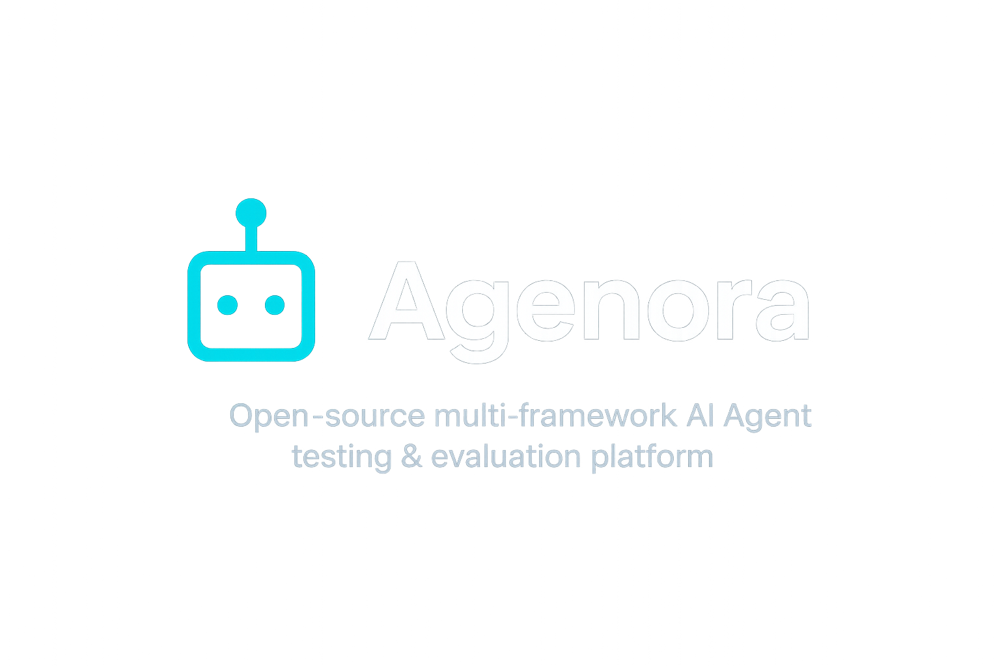

# 🚀 Agenora

<div align="center">



**The Open-Source Platform for AI Agent Orchestration**

[](https://opensource.org/licenses/MIT)
[](https://www.python.org/downloads/)
[](https://fastapi.tiangolo.com/)
[](https://github.com/RvTechiNNovate/Agenora/issues)
[](CONTRIBUTING.md)

</div>

## 🌟 Overview

Agenora is an open-source platform to test, compare, and evaluate AI agents across multiple frameworks (e.g., CrewAI, LangChain, Agno, LangGraph) and model providers (e.g., OpenAI, Anthropic, DeepSeek).
It provides built-in token usage & cost tracking, making it easy to monitor performance and expenses in one place.

## 📋 Key Features

### � Multi-Framework Support
- **CrewAI**: Build coordinated agent teams with specialized roles
- **LangChain**: Create versatile agents with powerful chains and tools
- **Agno**: Develop streamlined agents with clean APIs
- **LangGraph**: Build complex reasoning workflows with graph-based architectures
- **Extensible Plugin System**: Easily add new frameworks through our modular architecture

### 🤖 Agent Management
- Create agents with custom configurations 
- Define roles, tasks, and backstories
- Choose language models and set parameters
- Start, stop, and monitor agents
- Version tracking and rollback capabilities
- Persistent storage with database support

### 🧪 Interactive Playground
- Test agents in real-time via a chat interface
- Send queries and view agent responses
- Compare outputs across different LLM providers
- Debug agent reasoning processes
- Share agent sessions with team members

### 📊 Analytics and Monitoring
- Track token usage and costs across providers
- Monitor agent performance and response times
- Analyze conversation history and patterns
- Export data for external analysis

### ⚙️ Production-Ready
- Database persistence using **SQLAlchemy**
- Comprehensive **logging system**
- **API key authentication** for security
- Robust **error handling and retries**
- **Docker containerization** for easy deployment
- Configurable environment settings  

---

## 🚀 Quick Start

### Local Development

1. Clone the repository:
   ```bash
   git clone https://github.com/RvTechiNNovate/Agenora.git
   cd Agenora
   ```

2. Create a virtual environment:

   ```bash
   python -m venv .venv
   source .venv/bin/activate
   ```

3. Install dependencies:

   ```bash
   pip install -r requirements.txt
   ```

4. Set up environment variables:

   ```bash
   cp backend/.env.example backend/.env
   # Edit backend/.env with your API keys and settings
   ```

5. Run the application:

   ```bash
   python run.py
   ```

6. Open [http://localhost:8000](http://localhost:8000) in your browser.

---

### Docker Deployment

1. Configure environment variables:

   ```bash
   cp backend/.env.example backend/.env
   # Edit backend/.env with your API keys and settings
   ```

2. Build and run with Docker Compose:

   ```bash
   docker-compose up -d
   ```

3. Open [http://localhost:8000](http://localhost:8000) in your browser.

---

## ⚙️ Configuration

See [`backend/config.py`](backend/config.py) for all available settings.
Details on server, security, database, and performance parameters are listed in the [docs](docs/architecture.md#⚙️-configuration).

---

## 📖 API Documentation

* Swagger UI → [http://localhost:8000/api/docs](http://localhost:8000/api/docs)
* ReDoc → [http://localhost:8000/api/redoc](http://localhost:8000/api/redoc)

Key Endpoints:

* `GET /api/agents` – List all agents
* `POST /api/agent` – Create new agent
* `GET /api/agent/{id}` – Get agent details
* `POST /api/agent/{id}/start` – Start an agent
* `POST /api/agent/{id}/stop` – Stop an agent
* `POST /api/agent/{id}/query` – Query an agent
* `GET /api/health` – Health check

---

## 🏗️ Architecture

The system follows a **clean architecture pattern** with:

* **API Layer** (FastAPI routes)
* **Service Layer** (agent managers with framework-specific implementations)
* **Data Layer** (SQLAlchemy ORM models)
* **Configuration Layer** (modular, environment-based config)
* **Frontend** (Interactive dashboard UI)

<details>
<summary>View Architecture Diagram</summary>
<p align="center">
  
</p>
</details>

👉 See [docs/architecture.md](docs/architecture.md) for full details and diagrams.

---

## 🔌 Extensibility

### Adding New Agent Frameworks

Agenora is designed for easy extension with new agent frameworks:

1. Create a framework directory in `backend/agent_manager/agent_providers/your_framework_name/`
2. Implement the framework manager following the BaseAgentManager interface
3. Create framework-specific configuration and database models
4. Add frontend components for framework-specific settings

Comprehensive documentation is available in our [Framework Integration Guide](docs/framework_integration_guide.md).

---

## 🤝 Contributing

We welcome contributions! 🎉

1. **Fork** the repo
2. **Create a feature branch**

   ```bash
   git checkout -b feature/your-feature
   ```
3. **Commit** your changes with clear messages
4. **Push** and open a **Pull Request**

✅ Please make sure to:

* Follow the project’s structure & style
* Add/update tests where relevant
* Update documentation for new features

---

## 🗺️ Roadmap / Next Steps

<table>
  <tr>
    <td width="50%">
      <h3>Core Enhancements</h3>
      <ul>
        <li>✅ Agent versioning & snapshots</li>
        <li>✅ Multiple framework support (CrewAI, LangChain, Agno, LangGraph)</li>
        <li>⏳ Side-by-side model comparison</li>
        <li>⏳ Replay & debugging mode</li>
        <li>⏳ Remote MCP protocol support</li>
      </ul>
    </td>
    <td width="50%">
      <h3>Monitoring & Analytics</h3>
      <ul>
        <li>✅ Basic performance monitoring</li>
        <li>⏳ Token usage & cost tracking</li>
        <li>⏳ Comprehensive analytics dashboard</li>
        <li>⏳ Crash/timeout alerting system</li>
        <li>⏳ Export & reporting features</li>
      </ul>
    </td>
  </tr>
  <tr>
    <td width="50%">
      <h3>Collaboration</h3>
      <ul>
        <li>⏳ Multi-user teams with RBAC</li>
        <li>⏳ Agent sharing & cloning</li>
        <li>⏳ Collaborative editing</li>
        <li>⏳ Comments & annotations</li>
      </ul>
    </td>
    <td width="50%">
      <h3>Templates & Marketplace</h3>
      <ul>
        <li>⏳ Prebuilt agent templates</li>
        <li>⏳ Community-driven marketplace</li>
        <li>⏳ Rating & review system</li>
        <li>⏳ Easy import/export</li>
      </ul>
    </td>
  </tr>
  <tr>
    <td width="50%">
      <h3>Deployment & Integration</h3>
      <ul>
        <li>✅ Docker containerization</li>
        <li>⏳ Deploy agents as APIs</li>
        <li>⏳ Chat widget SDK for websites</li>
        <li>⏳ Webhooks & triggers</li>
        <li>⏳ CI/CD integration</li>
      </ul>
    </td>
    <td width="50%">
      <h3>Framework Support</h3>
      <ul>
        <li>✅ CrewAI integration</li>
        <li>✅ LangChain integration</li>
        <li>✅ Agno integration</li>
        <li>✅ LangGraph integration</li>
        <li>⏳ Support for AutoGen, Haystack</li>
      </ul>
    </td>
  </tr>
</table>

## 📚 Documentation

- [Architecture Overview](docs/architecture.md)
- [Framework Integration Guide](docs/framework_integration_guide.md)
- [API Documentation](docs/api_docs.md)
- [Configuration Options](docs/configuration.md)
- [Deployment Guide](docs/deployment.md)
- [Contributing Guidelines](CONTRIBUTING.md)

## 📜 License

This project is licensed under the MIT License - see the [LICENSE](LICENSE) file for details.

## 🙏 Acknowledgements

- [CrewAI](https://github.com/joaomdmoura/CrewAI) - Framework for building agent-based systems
- [LangChain](https://github.com/langchain-ai/langchain) - Framework for LLM applications
- [Agno](https://github.com/agno-ai/agno) - Toolkit for building AI agents
- [LangGraph](https://github.com/langchain-ai/langgraph) - Framework for building stateful, multi-agent applications
- [FastAPI](https://fastapi.tiangolo.com/) - Modern web framework for API development

---

